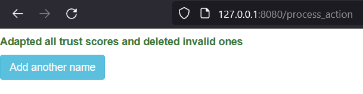

# Knowledge Base Tool with autocomplete function and probabilistic reasoning logic

This Python project was developed as part of the master course **Development Methods of Applied Intelligent Software Systems** in the winter semester 2022/23 at Riga Technical University.

## System Design and Functionality

**Database insert and autocomplete function**

The user can insert new names into the knowledge base via a text field. The text field suggests similar names through the autocomplete function. An additinal link to the result table (knowledge base) is provided. 

- Flask form implementation in `entry_from.py`
- On submit logic in `app.py` through the *add_entry()* function
- Database creation in `knowledgebase_db.py`
- Database initialization in `knowledgebase.py`
- Database connection via *create_connection()* in `db_handler.py`

 
<figcaption><I>Figure 1: Entry form with autocomplete function</I></figcaption>

&nbsp;

**Confirmation message and process continuation**

A successful insert gives back a short confirmation message. The user can now insert another name or view the result table.

 
<figcaption><I>Figure 2: Success message and links to next process steps</I></figcaption>

&nbsp;

**Result table**

The result table displays the entries with the highest trust score. The initial trust score is defined randomly with a float value between 0 and 1. Each row provides buttons to approve or reject the result.

 
<figcaption><I>Figure 3: Result table with approve and reject option</I></figcaption>

&nbsp;

**Recalculating the trust score based on probabilistic reasoning**

Probabilistic reasoning value can be calculated through the formula: 

$PK* = PK_{previous} + (1-PK_{previous}) * PK_{new}$

In this case $PK_{new}$ is predefined.
If a result is approved, the selected row is recalculated to a higher trust score.
If the result is rejected, every row is given a lower trust score. Every score with a value < 0.2 is deleted from the database.

  
   

<figcaption><I>Figure 4 & 5: Acceptance and Rejection message</I></figcaption>

Author:
* [Laslo Harry Welz](https://github.com/LasHarry)
